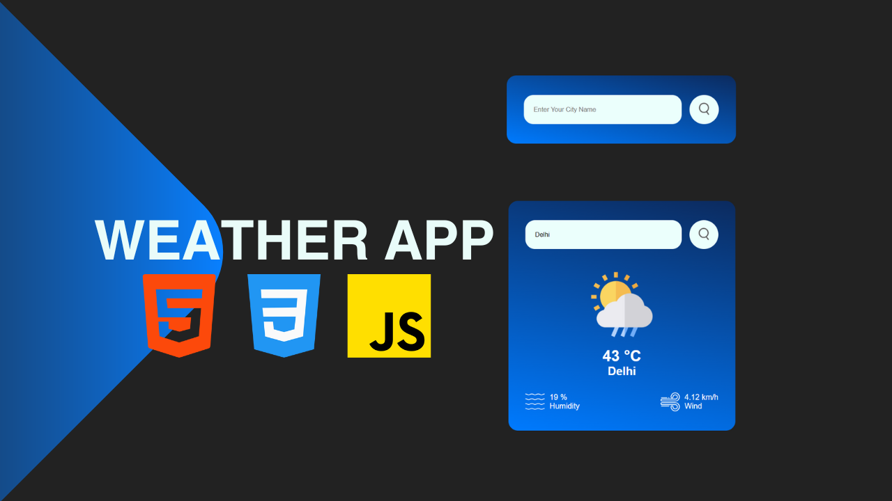

# Weather App

## Overview
This project is a simple and intuitive Weather App built using HTML, CSS, and JavaScript. The app fetches real-time weather data from the OpenWeatherMap API and displays it on the website. Users can search for the current weather conditions of any city.

## Features
- Displays current weather data such as Temperature, Weather Condition, Humidity, and Wind Speed.
- Search box to enter a city name and retrieve its weather information.
- Clean and responsive user interface.

## Technologies Used
- HTML
- CSS
- JavaScript
- OpenWeatherMap API
