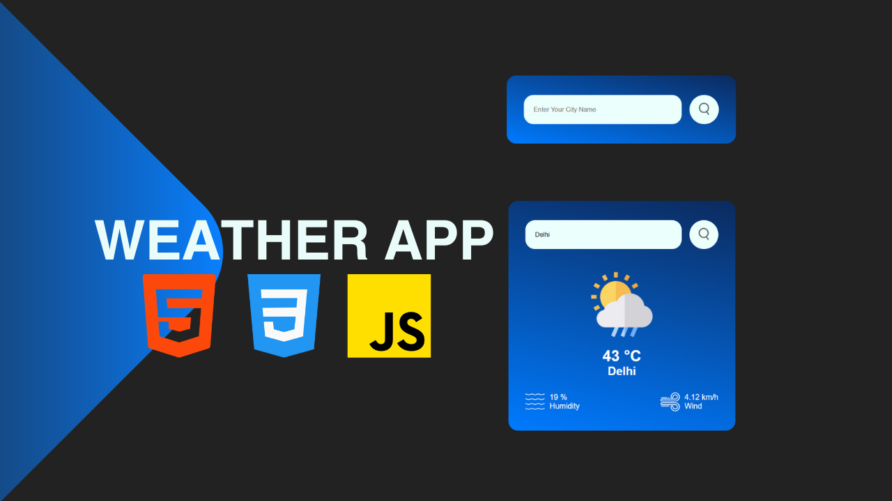

# JavaScript Projects

| Project Title | Screenshot                                         | Live Link      | Description                                                                                                                                                                           |
| ------------- | -------------------------------------------------- | -------------- | ------------------------------------------------------------------------------------------------------------------------------------------------------------------------------------- |
| Weather App   |      | [Live Demo](#) | A simple weather application that provides current weather information based on the user's location. It fetches data from a weather API and displays it in a user-friendly interface. |

## Installation

To install and run each project locally, follow these steps:

1. Clone the repository:
   ```bash
   git clone https://github.com/your-username/your-repo.git
   ```
2. Navigate to the project directory:
   ```bash
   cd your-repo/ProjectName
   ```
3. Install dependencies:
   ```bash
   npm install
   ```
4. Run the project:
   ```bash
   npm start
   ```

## Contributing

If you'd like to contribute, follow these steps:

1. Fork the repository.
2. Create a new branch:
   ```bash
   git checkout -b feature/your-feature-name
   ```
3. Commit your changes:
   ```bash
   git commit -m "Add feature"
   ```
4. Push to the branch:
   ```bash
   git push origin feature/your-feature-name
   ```
5. Open a pull request.

## License

This project is licensed under the XYZ License - see the LICENSE file for details.
